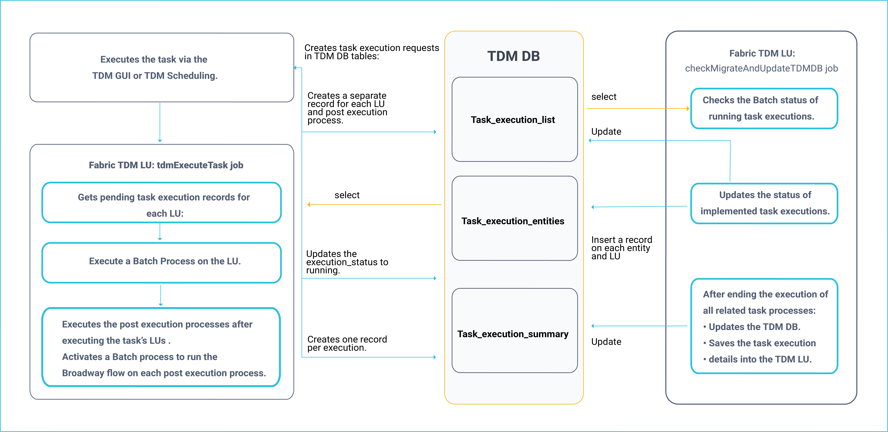
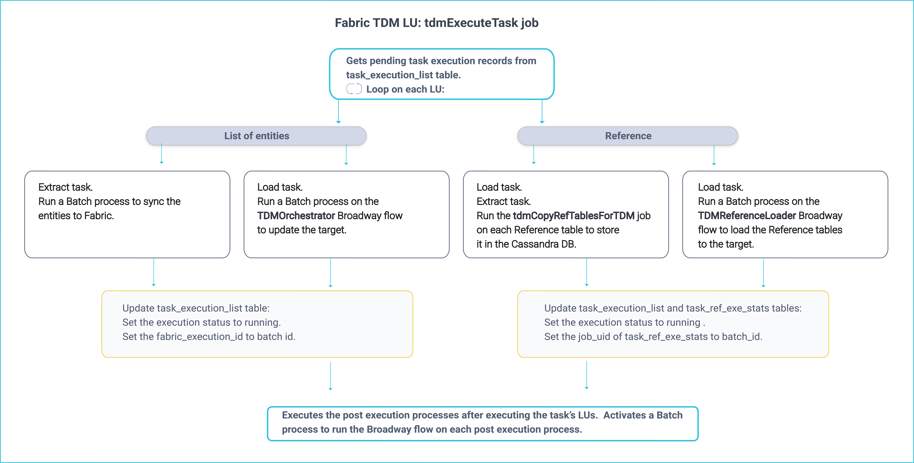

# Task Execution Processes

The task execution process has several steps:

1. Creating task execution request.
2. Initiate a Batch process on each task's LU and post execution process in a-synchronic mode.
3. Update the status of the completed processes.

The [first step](/articles/TDM/tdm_gui/26_task_execution.md) can be initiated either by the TDM GUI or the TDM Scheduling process.

This article focuses on the 2nd and 3rd steps.

The task can include the following:

- Entities
- Reference tables
- Post Execution processes. For example, sending a mail to the user after the execution ends. 

The following diagram displays the task execution flow:

### Main TDM Task Execution Process: tdmExecuteTask Job

This job runs every ten seconds and scans [task_execution_list](02_tdm_database.md#task_execution_list) TDM DB table and gets pending task execution requests.

Every task execution gets a unique identifier: **task_execution_id**. A task execution may include several LUs and post execution processes and each one has a separate record in task_execution_list. However, all the related records that belong to a given task execution, have the same **task_execution_id**. 

The task execution order of the related task's components is set as follows:

1. LUs: run the LUs from parent to child.  Process all the related entities on each LU before moving to its child LU.

   Click for more information about the [execution order of hierarchical LUs](03_business_entity_overview.md#task-execution-of-hierarchical-business-entities).

2. Post Execution Processes: run the post execution processes after the execution of the LUs ends. The post execution processes are executed by their [execution order](04_tdm_gui_business_entity_window.md#post-execution-processes-tab) as defined in the task's BE. 

The following diagram describe the TDM Task execution process flow:

The execution is done on asynchrony mode: the **tdmExecuteTask** job starts the execution on each LU or post execution process and a separate job - **checkMigrateAndUpdateTDMDB** - checks and updates the execution status of each process.

Both jobs must work in parallel. 

**Example:**

1. Execute a task with **Customer and Billing LUs** and with a post execution process which sends a mail when the task execution ends. Customer is the parent LU of Billing. 
2. Three records are created in task_execution_list on this task. All of them have the same task_execution_id.
3. **tdmExecuteTask** job executes the Batch process on **Customer LU**. 
4. **checkMigrateAndUpdateTDMDB** job updates the status of **Customer LU** when the execution is completed.
5. **tdmExecuteTask** job starts the execution of **Billing LU**, since its parent LU - Customer - is marked as completed.
6.  **checkMigrateAndUpdateTDMDB** job updates the status of **Billing LU** when the execution is completed.
7. **tdmExecuteTask** job can start the execution of the **post execution process** after the execution of all task's LU ends.

## checkMigrateAndUpdateTDMDB Job

This job runs every ten seconds and check the execution status of running process. It select records from **task_execution_list** TDM DB table where execution_status is **running**.

The execution status is checked  as follows:

- Reference tables: check the execution status or all related Reference tables in [task_exe_ref_stats](02_tdm_database.md#task_ref_exe_stats) TDM DB table.
- Processed entities of each LU: check the batch status based on the **batch_id**, populated in **task_execution_list.fabric_execution_id** column by the tdmExecuteTask job. 

When the process is completed, update the following TDM DB tables:

- **task_execution_list**: update the execution_status and additional data.
- [task_execution_entities](02_tdm_database.md#task_execution_entities): populate each entity or Reference table and its status. Set the **id_type** to **ENTITY** or **REFERENCE** according the data type: entity or Reference table.
- [task_exe_error_detailed](02_tdm_database.md#task_exe_error_detailed): populate the execution errors on Extract tasks. Note that the execution errors of Load tasks are reported to this table by the **PopulateTableErrors** Actor.

### Handling Completed Task Executions

A task execution is completed when it does not have pending or running executions.  The **checkMigrateAndUpdateTDMDB** Job handles completed task executions as follows:

1. Updates the execution summary TDM DB tables.
2. Synchronizes the task execution details to Fabric. 

#### Updating Execution Summary TDM Tables

Updates the following TDM DB tables:

- [task_execution_summary](02_tdm_database.md#task_execution_summary)
- [task_exe_error_summary](02_tdm_database.md#task_exe_error_summary)

#### Sync the Task Execution ID to TDM LU

The TDM LU holds the execution details of each task execution. The TDM's **instance ID** is the **task_execution_id** generated by the TDM GUI for each task execution.

A completed task execution is synchronized into the TDM LU.  The execution information and the TDM execution reports are extracted from the TDM LUI data.

## 

