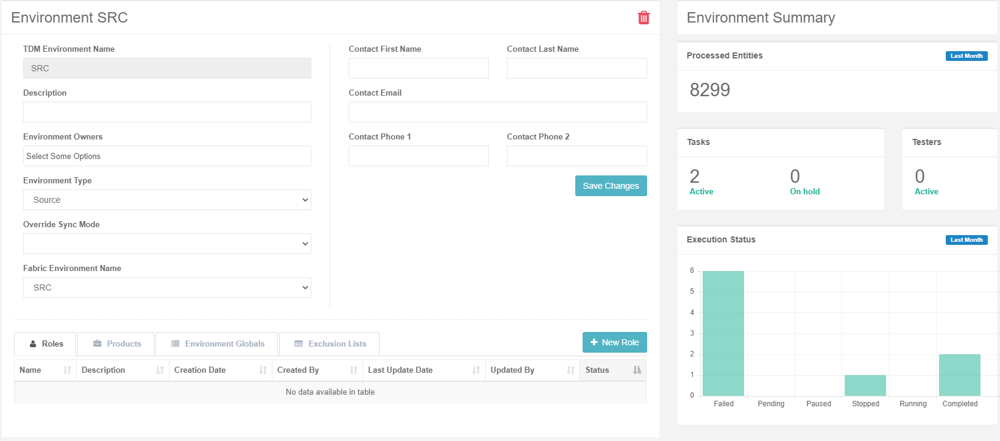

# TDM Environments Overview

The TDM can create and execute tasks only for environments, defined in the TDM. Each environment must be defined in the following TDM components:

- Fabric, set the [interfaces connection details and Globals values](/articles/25_environments/01_environments_overview.md) for each environment. 
- TDM GUI, set the following for each environment:

  - [General information](08_environment_window_general_information.md) like environment name, contact person, environment type (source, target or both).
  - [Environment owners](08_environment_window_general_information.md#environment-owners), add environment owners to setup and maintain an environment.
  - [Environments Products], attach [TDM Products](05_tdm_gui_product_window.md) to each environment.
  - [Environment Roles], define roles with permissions to the environment and attach [test users](02_tdm_gui_user_types.md) to the environment to enable them to create TDM tasks for the environment.
  - [Environment Globals], override Globals on an environment.
  - [Exclusion Lists], add lists of entities to be excluded from the TDM tasks in an environment.

Click to read more about [TDM environment setup in Fabric](/articles/TDM/tdm_implementation/20_tdm_fabric_implementation_environments_setup.md).
  ## Environments List Window

The **Environments** window displays a list of all environments defined in the TDM. Only **Admin users** can create, add or remove environment owners or delete an environment. Environment owners can edit their environment. Other users can open environments for view only purposes.

-   To create a new environment, click the **New Environment** button.
-   To open a selected environment, click the environment's **Name**.
-   To delete an environment, click  in the Environment window.

## Environment Window

The Environment window has the following sections:

- [General Information](08_environment_window_general_information.md).

- [Environment Summary](09_environment_window_summary_section.md)

- Environments tabs:

  - [Roles]
  - [Products]
  - [Environment Globals]
  - [Exclusion Lists]

 The following is an example of an Environment window:

  

  
