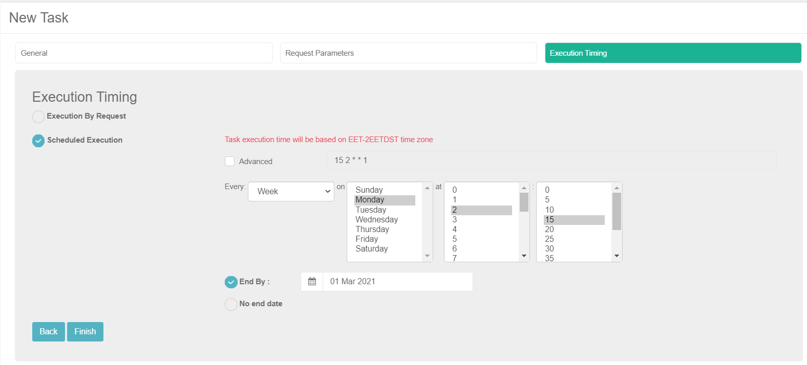

# Task Execution Timing Tab

This is the last tab of the task window and set the execution timing options. Select one of the following options:

- **Execution by Request**: the task is only executed when the user clicks theicon.
- **Scheduled Execution**: defines an automatic task execution by the [TDM scheduler process] on predefined intervals.  For example, execute the task every Monday at 2:15 AM:

Notes:

- A tester can select the Scheduled Execution option only if is permitted to select this method by their [role](10_environment_roles_tab.md#role-permissions) on the target environment. 
- A scheduled task can still be executed by request clicking theicon.

### Scheduled Execution Parameters

- The execution time interval is kept in the TDM as a **crontab** value. You can populate the scheduling parameters either by:
  - Check the **Advanced** setting and populate the crontab value manually.
  - Clear the **Advanced** setting (default option) and set the scheduling parameters using the TDM wizard. The following options are available:

<table width="900pxl">
<tbody>
<tr>
<td width="200pxl">

<strong>Every setting</strong>

</td>
<td width="350pxl">

<strong>At setting</strong>

</td>
<td width="350pxl">

<strong>On setting</strong>

</td>
</tr>
<tr>
<td width="200pxl">

Minute

</td>
<td width="350pxl">

N/A

</td>
<td width="350pxl">

N/A

</td>
</tr>
<tr>
<td width="200pxl">

Hour

</td>
<td width="350pxl">

select the number of minutes past the hour in gaps of 5 minutes: 0, 5, 10&hellip;

</td>
<td width="350pxl">

N/A

</td>
</tr>
<tr>
<td width="200pxl">

Day

</td>
<td width="350pxl">

Select hour and minutes

</td>
<td width="350pxl">

N/A

</td>
</tr>
<tr>
<td width="200pxl">

Week

</td>
<td width="350pxl">

Select an hour and minutes

</td>
<td width="350pxl">

Select a day of the week: Sunday, Monday&hellip;

</td>
</tr>
<tr>
<td width="200pxl">

Month

</td>
<td width="350pxl">

Select hour and minutes

</td>
<td width="350pxl">

Select a day in the month: 1st, 2nd &hellip;

</td>
</tr>
<tr>
<td width="200pxl">

Year

</td>
<td width="350pxl">

Select hour and minutes

</td>
<td width="350pxl">

Select a month and a day in the month. For example, 1st of February.

</td>
</tr>
</tbody>
</table>

- You can set the **End By** setting to run the task by a scheduler till a predefined date. For example, run the task every week till the end of Feb.

  

   

  

