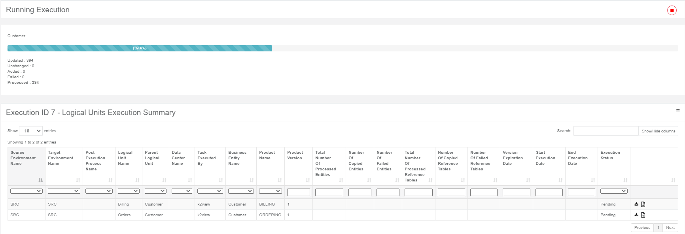
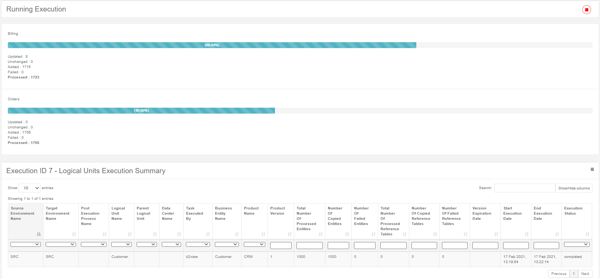
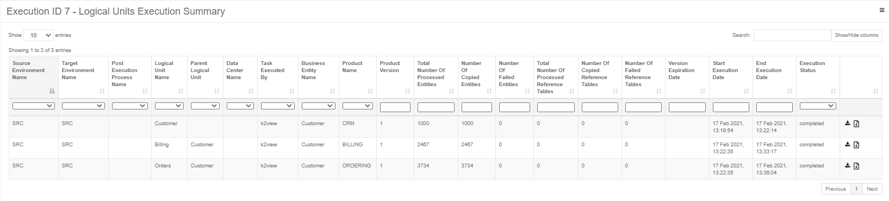
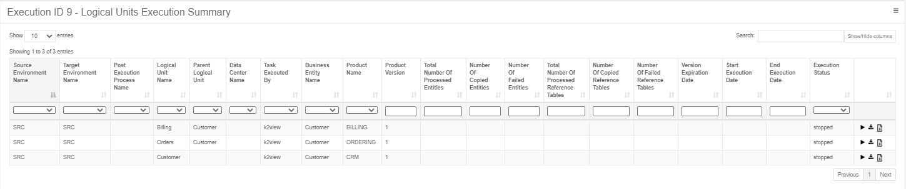

# Task Execution

A task can be executed multiple times either by clicking  or by a TDM scheduling process if the task's [Execution Timing](22_task_execution_timing_tab.md) is **Scheduled Execution**.

The TDM Scheduling process checks the **End Date** of the task's scheduling parameters. If the End Date is earlier than the current date, the process cleans the task's  **Scheduled Execution parameters** and skips the task execution. 

## Task Execution Order

A TDM task can include multiple LUs with a flat or hierarchical structure and post execution processes.

The execution of the related task components runs in the following order:

1. LUs: run the LUs from parent to child.  

   Click for more information about the [execution order of hierarchical LUs](03_business_entity_overview.md#task-execution-of-hierarchical-business-entities).

2. Post Execution Processes: run the post execution processes after the execution of the LUs ends. The post execution processes are executed according to their [execution order](04_tdm_gui_business_entity_window.md#post-execution-processes-tab) as defined in the task's BE. 

## Monitoring Task Execution

You can view the execution status of the running task via the TDM GUI. The TDM GUi displays the list of the LUs and post execution processes related to the task and their execution status.

**Example:**

- Executing and extract task with the following LUs:
  - Customer - this is the root LU
  - Billing and Orders - these are the children LUs of Customer LU.

- The Customer LU is executed before the Billing and Orders LUs:

  

- The Billing and Orders LUs are executed after the execution of the Customer LU is completed:

  

- The **Logical Units Execution Summary** window displays the summary execution details of each LU or post execution process:

  

## Stop and Resume a Task Execution

You can stop the task execution if the processed entities fail due to an error, fix the error, and then resume the task execution. The resumed execution starts from the last point when the task has stopped:

- Click the in the right corner of the **Running Execution** window to stop the task execution. The stop execution stops the execution of running or pending task's LUs or post execution processes and sets their execution status to **stopped**.

- Click the  next to one of the records in the **Logical Unit Summary**  with **stopped** execution status to resume the execution of **all** the stopped task's LUs and post execution processes:

  

## Holding Task Execution

Occasionally you may need to temporarily set a task to on-hold. For example, if the testing environment is temporarily down, to hold all task executions on an environment until the testing environment is up again and to then reactivate the tasks for this environment.

Hold or Activate task activities are enabled only for Active tasks. When a task is deleted (set to Inactive), its task execution status cannot be modified.

Tasks with an **on-Hold** task execution status cannot be executed.  

Hold and Activate task buttons are displayed on the Tasks screen of each task:

- To set the task to on-hold (pause), click .
- To activate a task execution status, click .

### Who Can Hold or Activate a Task?

- Admin user, can hold or activate all active tasks.
- Environment owner user, can hold or activate all active tasks in their environment.
- Testers, can hold or activate their active tasks.

**Notes:**

- To execute a scheduled task on demand, click . 

- Both the TDM GUI and TDM Scheduling processes initiate an execution request in the TDM DB. The TDM task execution process gets pending execution requests and executes the tasks.

  Click for more information about the [TDM task execution process](/articles/TDM/tdm_architecture/03_task_execution_processes.md).

- A task cannot be executed several times in parallel. An additional execution can be initiated only if the previous execution has ended.

- The TDM Scheduling process skips running tasks.

- The TDM Scheduling process skips on-hold tasks.

  

