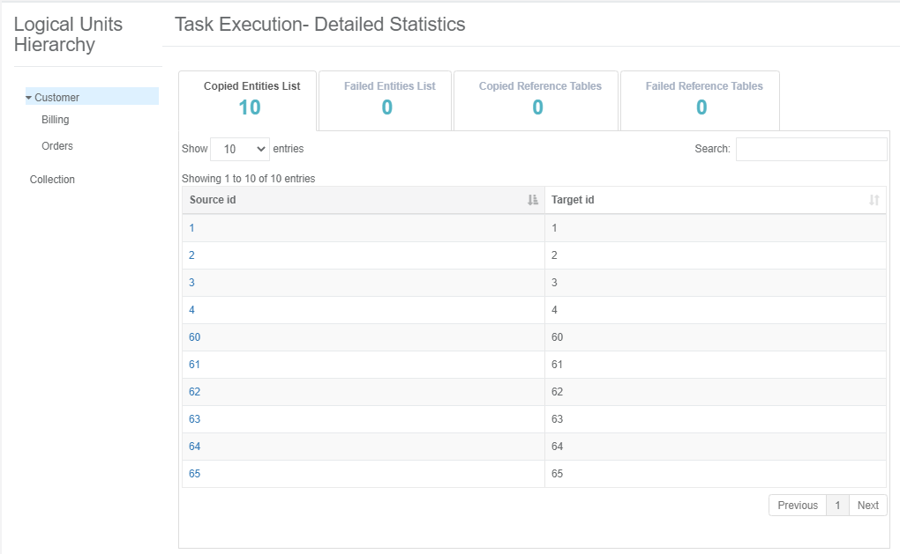
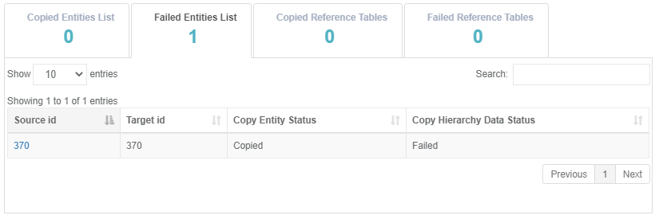

# Task Execution History

The TDM GUI has several windows to display the execution history on a given task:

- [Task Execution Summary](#task-executions-summary) :  displays the list of the executions of the task.
- [Logical Units Execution Summary](#logical-units-execution-summary) : displays the list of related LUs and post execution processes of a given task execution.
- [Task Execution- Detailed Statistics]() : displays the hierarchical structure of the copied and failed entities of a given task execution.

## Task Executions Summary 

Display of the a task's executions list. Note that an editing a task creates a new version on the task. Each version has its own record in the Tasks Lists window and has its own task execution summary. 

Open the [Tasks List window](14_task_overview.md#tdm-tasks-list-window) and click the icon next to the selected task to open the Task Execution Summary window for the task and display the full list of the task's executions:

Click **Show/Hide Columns** to open a popup window displaying the list of available fields for each task. Fields in green are displayed by default.  Click a field to remove it from the display.

The following information is displayed on each task execution:

- Task_execution_id
- Source and target environments
- Task Executed By:  the username who has executed the task
- BE name
- Summary statistics about the processed entities, Reference tables, and post execution processes.
- Execution status: will be set to completed if all the related task's processed have been completed successfully.

### Generating Task Execution Summary Report

Click the icon next to each task execution to generate and download a summary execution report.

Example of Summary Execution Report:

[summary execution report example](ExtractDataFlux_Summary_Execution_Report_EXECID_12.xlsx)

## Logical Units Execution Summary

Display of a task execution LUs and post execution processes. Click the **Task Execution Id** setting of a given task in **Task Execution Summary** window. 

The following window is opened:

Click **Show/Hide Columns** to open a popup window displaying the list of available fields for each task. Fields in green are displayed by default.  Click a field to remove it from the display.

The window provides a summary information about the execution of each LU or post execution process related to a given task execution.

### Generating Task Execution Report on each Process

#### Load Tasks

Click the icon next to each LU to generate and download a summary execution report of the LU. The execution report displays information about the LU execution:

- General information
- Entities List
- Reference Tables List
- Execution Errors
- Replaced Sequences

#### Extract Tasks

##### Summary Report

- Click the  to generate and download the summary report on the LU's execution.
- The summary report displays the [Batch Command](/articles/TDM/tdm_architecture/03_task_execution_processes.md#main-tdm-task-execution-process-tdmexecutetask-job) to sync the entities into Fabric and summary execution information on each Fabric node and on the Fabric cluster levels.

##### Detailed Report

- Click the  to generate and download the summary report on the LU's execution.
- The detailed report displays the entities and Reference tables list, their execution status, and error message if the execution of a given entity or Reference table fails.

## Task Execution - Detailed Statistics

Displays the detailed information about the number of copied and failed entities and Reference tables in a given task execution, the hierarchical structure of the LUs and their entities, and a sample list of copied and failed entities and Reference tables.

Click icon in the right corner of the **Logical Units Execution Summary** window to open the **Task Execution - Detailed Statistics** window.

The following window is opened:

The left pane displays the [hierarchical tree of the task's LU](/articles/TDM/tdm_overview/03_business_entity_overview.md#building-an-lu-hierarchy-in-a-be) and the right pane displays the number of copied and failed entities and Reference tables, and a sample of entities and Reference tables. 

By default, the root LU's list of entities and Reference tables is displayed, but you can click on any LU in the **Logical Units Hierarchy** to view its entities and Reference tables.

The following sequences are displayed on each entity ID: Source ID and Target ID. The Target ID can be different from the Source ID if the task [replaces the source sequences](19_load_task_request_parameters_regular_mode.md#replace-sequences).

If one of the LUs in the tree has failed entities, this LU is marked by red.

### Failed Entities List Tab

An entity is marked as failed if its process fails or if one of their children ID fails. For example, a Customer ID is marked as failed if the copy of one of their orders fails.  The Failed Entities List tab displays both statuses: 

- Copy Entity Status: marked as Failed if the task execution fails to process the entity ID.
- Copy Hierarchy Data Status: marked as Failed of the task execution fails to process one of the children IDs.

### View the Hierarchy of a Selected Entity

Click on the **Source Id** setting of a given entity to view its hierarchy. 

Example:

View Customer #10:

Click the Billing LU to view the Subscriber IDs of Customer #10:

Click the Orders LU to view the Order IDs of Customer #10:

Click one of the children Order IDs - Order #60 - to view its hierarchical structure:

  

