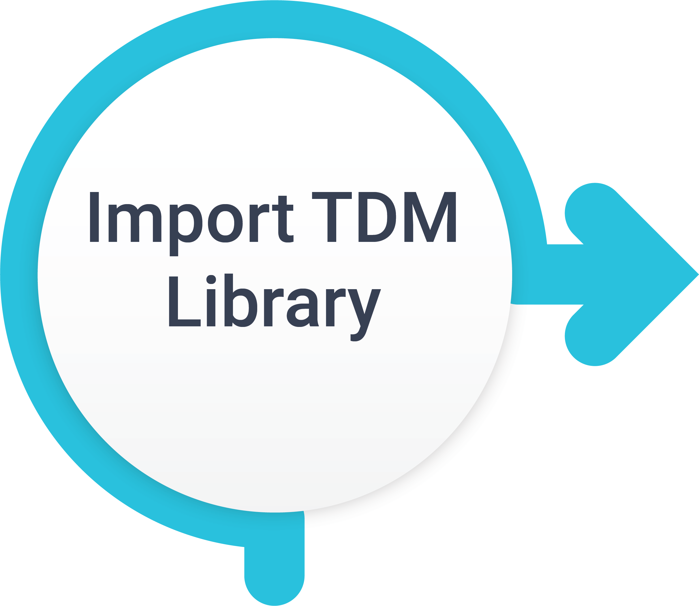
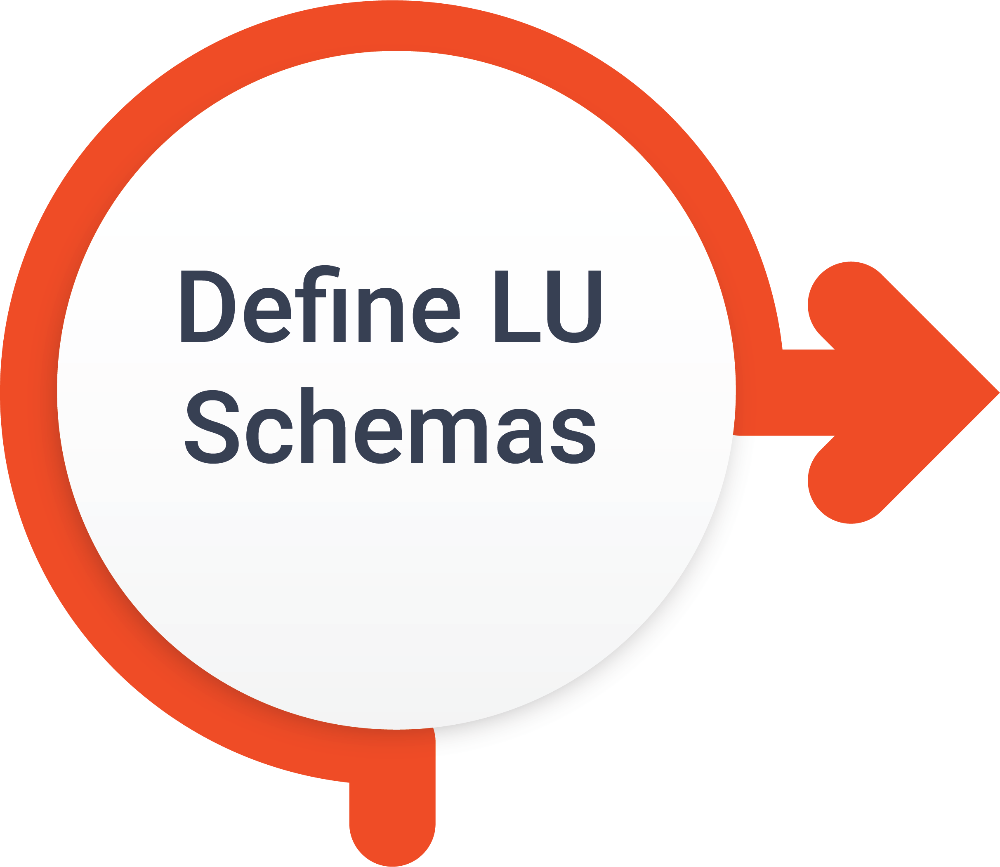
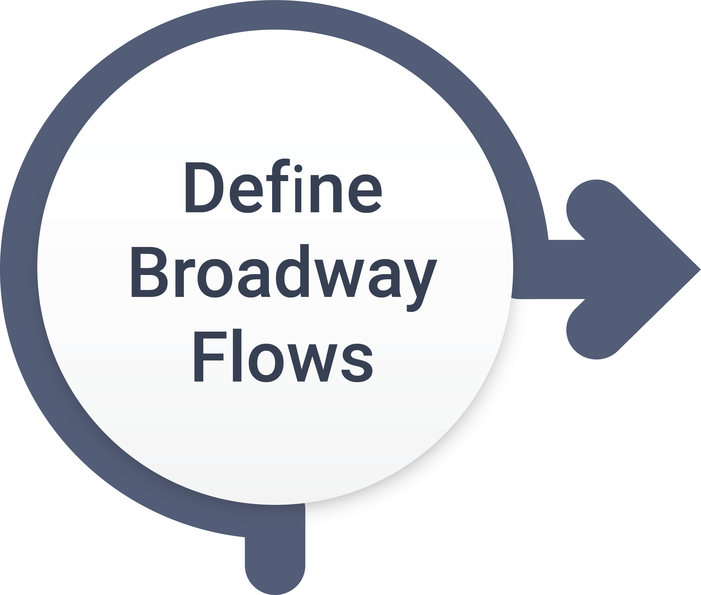
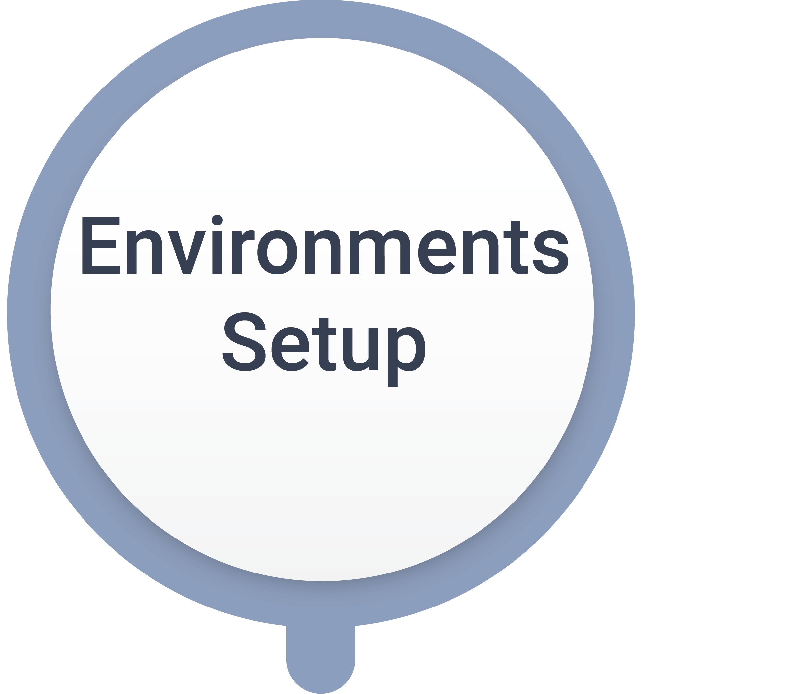

# TDM - Fabric Implementation Overview

 Implementation of the TDM  in Fabric involves several steps. The following illustration displays the main ones:

 

A Fabric TDM project has the following:

- TDM Utilities, TDM Web Services and [TDM LU](04_fabric_tdm_library.md#tdm-lu).
- Logical Units that model TDM entities and their related data to LUs such as Customer, Billing, Ordering, etc.
- Broadway Flows which are defined under each LU to delete or load the entities from the target environment.
- Handling special cases, references, post-execution processes such as sending mail at the end of a task's execution or masking sensitive data.
- Environment setup, defining the source and target environments of the TDM. Setting the connection details of interfaces and the Globals in each environment.

K2view offers a TDM library with TDM utilities as well as TDM Templates for Broadway flows. These utilities must be implemented by the TDM Fabric project. 

