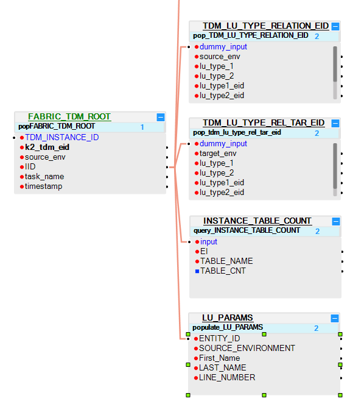

# TDM LU Implementation - Generic Guidelines

A TDM task copies a selected [Business Entity](/articles/TDM/tdm_overview/03_business_entity_overview.md) from the selected source environment to the selected target environment. A Business Entity can have multiple [LUs](/articles/03_logical_units/01_LU_overview.md) with a flat or a hierarchical structure. For example, a Customer Business Entity can consist of Customer Care, Billing, Ordering and Usage LUs. The ability to break a BE up into several LUs enables maximum flexibility and avoiding duplicate development. In addition, defining a hierarchical structure of parent-child LUs enables creating LUs based on the natural root entity of the related data sources instead of forcefully setting unified root entities on all LUs related to a given BE.

Each LU in a TDM project must have additional components to support TDM functionality.

## LU Basic Structure

Each LU in a TDM project has the following structure:

- Dummy root table: FABRIC_TDM_ROOT. 

- TDM generic LU tables linked to the root table. 

- Two main branches linked to the root table:

  - **Source branch**, LU tables that extract an entity's source data.  Source LU tables are populated when a TDM task needs to copy (insert) entities to a target environment and therefore must extract the source data of these entities.

  - **Target branch**, LU tables that extract the target keys of an entity. The keys are extracted from the target environment to enable deleting an entity from a target environment if required by the TDM task.

    [Click for more information about delete entities from the target environment].

### Step 1 - Copy the Objects from the TDM_LIBRARY LU into Each LU

Import the [TDM_LIBRARY LU](/articles/TDM/tdm_implementation/04_fabric_tdm_library.md#tdm_library-lu) from the **TDM Library** to your project and copy the LU level objects in the TDM_LIBRARY to your LU.

### Step 2 - Add the TDM Root Table to the LU Schema

1. Add the **FABRIC_TDM_ROOT** LU table to the LU Schema and set it as a [Root table](/articles/03_logical_units/08_define_root_table_and_instance_ID_LU_schema.md). 

2.  Set the **Instance PK** column to **k2_tdm_eid** and verify that the **fnCheckInsFound** enrichment function under Shared Objects is attached to the LU table. 
    This function only runs if the TDM task inserts the entity to the target, and therefore must extract its data from the data source. It validates that the entity (IID) exists in the main source LU tables. If the entity is not found in the source table, the entity is rejected. 
3. Add the **LU_PARAMS**, **INSTANCE_TABLE_COUNT**, **TDM_LU_TYPE_RELATION_EID** and **TDM_LU_TYPE_REL_TAR_EID** to the LU Schema and link the tables to the **FABRIC_TDM_ROOT.IID** :

4. Add the LU_PARAMS LU table to each LU Schema (also when it is not required for defining LU parameters) whereby the LU_PARAM table only holds the ENTITY_ID and SOURCE_ENVIRONMENT fields.

5. Edit **trnLuParams** and **LU_PARAMS** and add selection parameters to the LU. 

   Click for more information about [Handling TDM Parameters](07_tdm_implementation_parameters_handling.md).

6. Mask sensitive data in LU tables using a Broadway population and the [Masking Actor](/articles/19_Broadway/actors/07_masking_and_sequence_actors.md). 

   Click for more information about [TDM Masking].

### Step 3 - Add the Source LU Tables to the LU Schema

1. Link the main source LU tables to the FABRIC_TDM_ROOT table. 

2. Verify that the main source LU tables are also populated in [ROOT_TABLE_NAME Global](/articles/TDM/tdm_implementation/04_fabric_tdm_library.md#globals).

3. When populating the main source LU tables, comply with the following conditions. 
   - The TDM task must [copy (insert) the entities] to the target environment.
   - Do not request to [avoid synchronizing] the entities from the source.  

   Note that an exception is thrown when the Sync Mode is set to Off before the first sync since the LUI does not yet exist in Fabric and Fabric cannot extract the data from its source.

4. Create the population of the main source LU tables based on the [Root function](/articles/07_table_population/11_1_creating_or_editing_a_root_function.md). 

5. Edit the Root function of the main source LU tables based on the [TBD- add the template when its ready] template. The updated Root function checks the above conditions.  

6. Link the remaining source LU tables to the main LU tables so that if the main source LU table is not populated, the remaining source LU table also remains empty.

### Step 4 - Add the Target LU Tables to the LU Schema

1. Define the LU tables to extract the target keys to enable deleting an entity from the target.

2. Link the main target LU table to the FABRIC_TDM_ROOT table.

3. Add the **fnDecisionDeleteFromTarget** Decision function to the main target root table. Note that this Decision function is under Shared Objects and is imported from the [TDM Library](04_fabric_tdm_library.md).

4. Link the remaining target LU tables to the main target LU table.

   Click for more information about [deleting entities] from target environment via a TDM task.

### LU Debug

The LUI must include the source environment which must be set as the [active environment](/articles/25_environments/01_environments_overview.md) in Fabric. When debugging the TDM implementation in Fabric, the debug server either:

- Populates the source environment using `_dev_`. For example, **_dev_1**.
- Creates and deploys the environment to the Fabric Debug server.

Set the source environment as an active environment and concatenate this source environment to the Entity ID (IID). For example, **UAT_1**.  

