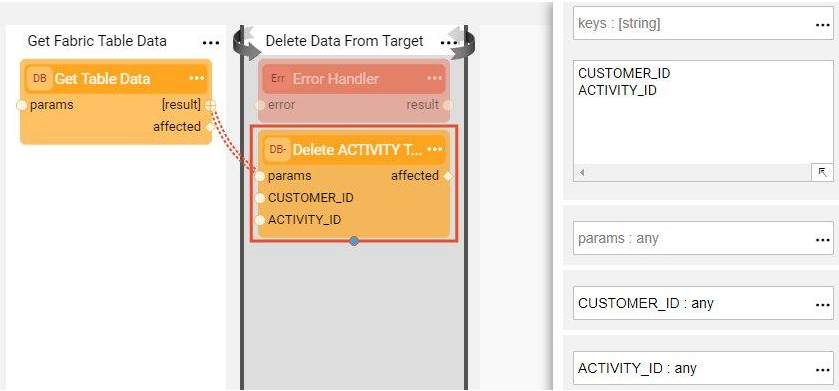

# Broadway Flows Implementation

The TDM library has sets of generic flows that enable creating a standard TDM implementation in just a few minutes. Note that once a standard implementation has been created, its flows can be edited and tailored to your project's specific requirements.

## How Do I Create TDM Broadway Flows?

### Step 1 - Define Tables to Filter Out

Before starting the TDM implementation process, define the tables that are filtered out during the TDM Load to Target process. The library includes settings for the following filtered auxiliary tables:

This setting is implemented using the **TDMFilterOutTargetTables** Actor. To filter more tables from the TDM load, edit the Actor's settings. 

To do so, open the **TDMFilterOutTargetTables** Actor and edit its table input argument. The **lu_name** column should be populated as follows:

* ALL_LUS, when a table is relevant for all TDM Logical Units.
* [LU name], when a table belongs to a specific LU.

### Step 2 - Create Load and Delete Flows

In this step you will run the generic **createFlowsFromTemplates.flow** from the Shared Objects Broadway folder. The flow has the following inner flows:

1. #### Create a LOAD flow per table

Performed by the **createLoadTableFlows.flow** that receives the Logical Unit name, target interface and target schema and retrieves the list of tables from the LU Schema. It then creates a Broadway flow to load the data into each table in the target DB. The name of each newly created flow is **load_[Table Name].flow**. For example, load_Customer.flow. The tables defined in this step are filtered out and the flow is not created for them. 

2. #### Create the main LOAD flow

Performed by the **createLoadAllTablesFlow.flow** that receives the Logical Unit name and creates an envelope **LoadTables.flow** Broadway flow. The purpose of this flow is to invoke all LOAD flows based on the LU Schema's execution order.

3. #### Create a DELETE flow per table

Performed by the **createDeleteTableFlows.flow** that receives the Logical Unit name, target interface and target schema and retrieves the list of tables from the LU Schema. It then creates a Broadway flow to delete the data from this table in the target DB. The name of each newly created flow is **delete_[Table Name].flow**. For example, delete_CUSTOMER.flow. The tables defined in Step 2 are filtered out and the flow is not created for them. 

The following two updates must be performed manually:

* Populate the **sql** input argument of the **Get Table Data** Actor with the SELECT query that retrieves the keys of the data to be deleted. For example, in the delete_ADDRESS.flow, write the following query since the CUSTOMER_ID is the key of the ADDRESS table.

  ~~~sql
  SELECT CUSTOMER_ID FROM TAR_CUSTOMER;
  ~~~

  

* Populate the **keys** input argument of the **DbDelete** Actor. These should correlate with the table's key.

  

4. #### Create the main DELETE flow

Performed by the **createDeleteAllTablesFlow.flow** that receives the Logical Unit name and creates an envelope **DeleteAllTables.flow** Broadway flow. The purpose of this flow is to invoke all DELETE flows in the opposite order of the population order, considering the target DB's foreign keys. 

### Step 3 - Create the TDMOrchestrator.flow from the Template

Once all LOAD and DELETE flows are ready, create an orchestrator. The purpose of the **TDMOrchestrator.flow** is to encapsulate all Broadway flows in the TDM task. It includes the invocation of all steps such as:

* Initiate the TDM load.
* Delete the target data, if required by the task's [operation mode](/articles/TDM/tdm_gui/19_load_task_request_parameters_regular_mode.md#operation-mode) or the [Data Flux load task](/articles/TDM/tdm_gui/20_load_task_dataflux_mode.md[).
* Load the new data into the target, if required by the task's [operation mode](/articles/TDM/tdm_gui/19_load_task_request_parameters_regular_mode.md#operation-mode) or the [Data Flux load task](/articles/TDM/tdm_gui/20_load_task_dataflux_mode.md). 
* Manage the TDM process as one transaction.
* Perform [error handling and gather statistics](12_tdm_error_handling_and_statistics.md). 

The **TDMOrchestrator.flow** should be created from the Logical Unit's Broadway folder using a template as follows:

### Step 4 - Create the Sequence Creation Flows

Since sequences are required when populating a target DB, setting and initiating sequences is a mandatory part of creating a TDM implementation. These flows must be defined in the Shared Objects of your project since they must be available across various Logical Units. 

Examples of initiating sequence flows can be found in the TDM demo project. 

Each sequence flow initiation must include steps for getting the task execution ID and the original IID from Fabric, retrieving the next sequence value and populating the TDM_SEQ_MAPPING table. A flow must be created for each table in the LU schema. 

[Click for Sequence Implementation Guidelines](/articles/19_Broadway/actors/08_sequence_implementation_guide.md). 

To create a sequence flow initiation, do the following:

1. Create a flow for each table in the LU Schema using the following pattern:

   * Get the task execution ID, original IID and LU type from the session.

   * Get the sequence value using the **MaskingSequence** Actor and setting its input arguments for the project's requirements.

     [Click to learn how to set the input arguments of the MaskingSequence Actor](/articles/19_Broadway/actors/07_masking_and_sequence_actors.md#how-do-i-set-masking-input-arguments).

   * Populate the TDM_SEQ_MAPPING table for reporting purposes.

   

2. Save the flow and then save it as an Actor to enable invoking the flow as an [Inner Flow](/articles/19_Broadway/22_broadway_flow_inner_flows.md#save-as-actor).

3. Edit the Load flow of the related table. For example, create a sequence flow initiation for the Payment table. Then edit **load_PAYMENT.flow** by adding the sequence flow to the **Transformation** Stage and connecting its input and output arguments to the relevant columns. 
   

### Step 5 - Mask the Sensitive Data

TDM systems often handle sensitive data. To be compliant with Data Privacy laws, Fabric enables masking sensitive fields like SSN, credit card numbers and email addresses before they are loaded either to Fabric or into the target DB.

* To mask a sensitive field prior to loading it into Fabric, create a Broadway population flow for the table that includes this field and a **Masking** Actor. 

  

* To mask a sensitive field as part of Load to the Target DB, add a Masking Actor to the relevant **load_[Table Name].flow**. The TDM infrastructure controls enabling or disabling masking based on the settings in the global variables. There are three possible scenarios for handling masking:

  * When the TDM task is for synthetic data creation, masking is always enabled.
  * When The TDM task is for Data Flux, masking is always disabled.
  * In all other scenarios masking behavior depends on the MASK_FLAG settings.

[Click to learn how to use Masking Actors](/articles/19_Broadway/actors/07_masking_and_sequence_actors.md#).

