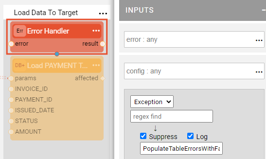

# TDM Error Handling and Statistics Flows

The TDM library delivers a generic error handling and statistics gathering mechanism. It is based on the Broadway capabilities tailored per TDM business requirements. 

The mechanism includes a set of generic flows that gather the errors and the statistics during the task execution and populate them into the dedicated tables. This data is used for the monitoring of TDM tasks and the creation of TDM execution reports.

### How Do I Perform Error Handling in TDM?

The TDM library includes two utility flows to handle the errors during the TDM task execution:

* PopulateTableErrorsWithFailed.flow
* PopulateTableErrorsWithReject.flow

Both utilities invoke the internal **PopulateTableErrors.flow** to populate the error details into the **task_exe_error_detailed** table. The difference between these two utilities is that the first one sets on the session level:

~~~
ENTITY_STATUS = failed 
~~~

It also sets the error category as *Entity Failed* in the **task_exe_error_detailed** table, while the second flow sets a record as *Record Rejected*.

The error handling utility is invoked from each Load flow's **Load Data To Target** Stage. The error is suppressed in order not to stop the task execution in the middle and to get to the statistics gathering step.

By default, the **PopulateTableErrorsWithFailed.flow** is invoked. If the record rejection is needed instead of failing the whole entity, replace the Inner flow name with **PopulateTableErrorsWithReject.flow**. 

[Click to learn how to use the ErrorHandling Actor](/actors/06_error_handling_actors.md#how-do-i-use-the-errorhandler-actor).

### How Do I Gather the Statistics in TDM?

The TDM library includes a utility flows to gather the statistics during the TDM task execution:

* PopulateTableStats.flow

This utility populates the statistics details into the **task_exe_stats_detailed** table, including the data such as the count of the records in the source and the target per each table. 

The stats gathering utility is invoked from each Load flow's **Report Statistics** Stage. 

<!--take the image from Taha-->

